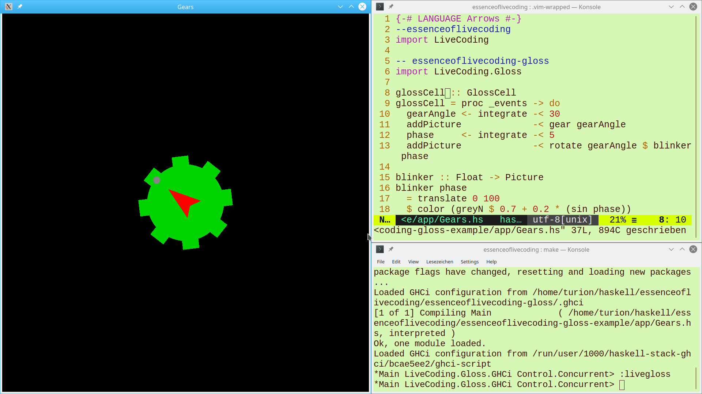
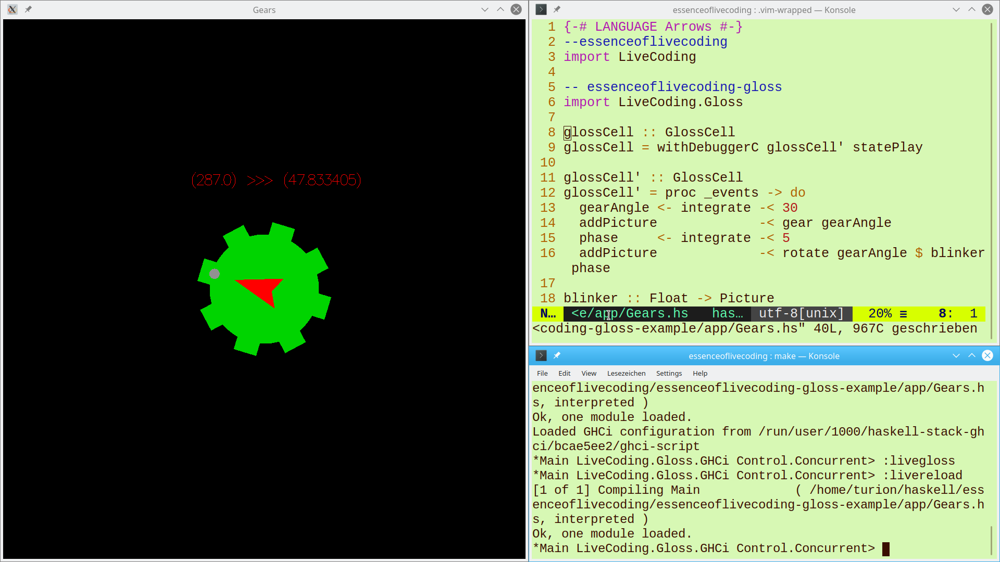

# Introduction

## The essence of live coding

* Live coding framework prototype
* Capture the essential idea
* Audio, video, web, ...
* Modular FRP DSL
* Type-driven, automatic, extensible state migration

## Change the program, keep the state!

{style="height: 400px;"}

# How does it work?

## A live program

* Internal state
* State transition function
* Side effects

##

``` {.haskell .literate .fragment .fade-in}
data LiveProgram m = forall s .
  LiveProgram
  { liveState :: s
  , liveStep  :: s -> m s
  }
```

``` {.haskell .literate .fragment .fade-in}
runLiveProgram :: LiveProgram m -> m ()
runLiveProgram LiveProgram { .. } = do
  liveState' <- liveStep liveState
  runLiveProgram LiveProgram { liveState = liveState', .. }
```

[Polymorphic in `m`:]{.fragment .fade-in}

* Determinism (no hidden `IO`)
* Arbitrary effects: Bind to any backend

## Example

``` {.haskell .literate .fragment .fade-in}
data State = State
  { nVisitors :: Integer
  }

server greeting = LiveProgram { .. } where
  liveState = State 1
  liveStep State { .. } = do
    putStrLn $ greeting ++ show nVisitors
    let nVisitors = nVisitors + 1
    return State { .. }

yeOldeServer = server "Greetings, number "
```

## Change the program...

``` {.haskell .literate .fragment .fade-in}
nuSrvr = server "HI #"
```

``` {.fragment .fade-in}
Greetings, number 1
Greetings, number 2
HI #3
```

## ...change the program...


``` {.haskell .literate .fragment .fade-in}
data State = State
  { nVisitors :: Integer
  , lastTime  :: UTCTime
  }

server greeting = LiveProgram { .. } where
  liveState = State 1 $ read "2019-07-24 19:00:00 UTC"
  liveStep State { .. } = do
    putStrLn $ greeting ++ show nVisitors
    let nVisitors = nVisitors + 1
    lastTime <- getCurrentTime
    return State { .. }
```

[...but the new state won't type-check!]{.fragment .fade-in .alert-red}

## ...keep the state??

* Well-known problem in databases
* Need _state migrations_
* Should be automatic

## Example

Migrating to new state should...

* ...preserve `nVisitors`
* ...insert initial/default value for `lastTime`

[⇒ Need _old live state_ and _new initial state_]{.fragment .fade-in}

``` {.haskell .literate .fragment .fade-in}
migrate :: a -> b -> a
```

::: notes

* Such a migrate function exists: `const`

:::


## Actual implementation: Generics

``` {.haskell .literate .fragment .fade-in}
migrate :: (Data a, Data b) => a -> b -> a
migrate = ... -- Just some 50 lines generic code
```

[Conversion from/to...]{.haskell .literate .fragment .fade-in}

* ...same record fields
* ...same constructor names
* ...newtypes

## Type-driven migration

Small restriction: Add `Data` to all states:

``` {.haskell .literate .fragment .fade-in}
data LiveProgram m = forall s .
  Data s =>
  LiveProgram
  { liveState :: s
  , liveStep  :: s -> m s
  }
```

[The migration is derived from the state type!]{.haskell .literate .fragment .fade-in}

# Functional Reactive Programming

## What's missing? [_Modularity_]{.fragment .fade-in}

* Want to combine new live programs from existing building blocks.
* _"Functional"_

[⇒ Add inputs and outputs to live programs!]{.fragment .fade-in}

## Cells

``` {.haskell .literate .fragment .fade-in}
data Cell m a b = forall s . Data s => Cell
  { cellState :: s
  , cellStep  :: s -> a -> m (b, s)
  }
```

## Cells

* `Category`:
{.fragment .fade-in style="border: none"}
{.fragment .fade-in style="border: none"}
* `Arrow`:
{.fragment .fade-in style="border: none"}
{.fragment .fade-in style="border: none"}
* `ArrowChoice`: (Transient) control flow


[`liveCell:: Cell m () () -> LiveProgram m`]{.fragment .fade-in}

## Wait... I've seen this before!?

``` {.haskell .literate .fragment .fade-in}
data MSF m a b => MSF { unMSF :: a -> m (b, MSF m a b) }
```

::: {.fragment .fade-in}

Haskell Symposium 2016
:::

## Example

``` {.haskell .literate .fragment .fade-in}
sumC = Cell { .. } where
  cellState = 0
  cellStep accum a = return (accum, accum + a)
```

``` {.haskell .literate .fragment .fade-in}
stepRate = 100
integrate = arr (/ stepRate) >>> sumC
```

::: notes

Syntactic sugar: Arrow notation

:::

``` {.haskell .literate .fragment .fade-in}
glossCell :: GlossCell
glossCell = proc _events -> do
  gearAngle <- integrate -< 30
  addPicture             -< gear gearAngle
  phase     <- integrate -< 5
  addPicture             -< rotate gearAngle $ blinker phase
```

## Monadic control flow

::: notes

* Exception just another monad
* Exception in the state => state migration preserves control flow state (e.g. to where we currently switched) out of the box

:::

[Throwing and catching exceptions]{.fragment .fade-in}

``` {.haskell .literate .fragment .fade-in}
wait :: Monad m => Double -> Cell (ExceptT () m) a a
wait tMax = proc a -> do
  t <- integrate -< 1
  if t >= tMax
    then throwC  -< ()
    else returnA -< a
```

``` {.haskell .literate .fragment .fade-in}
afterTwoSeconds :: Cell m a String
afterTwoSeconds = safely $ do
  try  $   arr (const "Waiting...")
       >>> wait 2
  safe $   arr (const "Done waiting.")
```

# Extra perks

## GHCi runtime

Custom GHCi commands:

* Launch live program in separate thread
* Edit file, reload, while keeping program running
* (uses package `foreign-store` under the hood)
* Gloss and Pulseaudio adapter

## QuickCheck

* Test output of cells for arbitrary series of inputs
* Launch test cell before migrating "production" cell
* `Data` ⇒ automatically generate cell state for tests

## Debugging

"A debugger is a live program that can read and modify
the state of another live program."

``` {.haskell .literate .fragment .fade-in}
newtype Debugger m = Debugger
  { getDebugger :: forall s .
      Data s => LiveProgram (StateT s m)
  }
```

``` {.haskell .literate .fragment .fade-in}
withDebugger
  :: Monad       m
  => LiveProgram m
  -> Debugger    m
  -> LiveProgram m
```

## Example: Gloss debugger



# Outlook

## What I haven't shown

* Works for web servers as well
* Extensible by custom user migrations
* Integrate into external main loops
* Control flow: The details

## Further directions

* Backends (Audio, web, OpenGL, ...)
* Integrate with asynchronous FRP framework (Rhine)
* Ensuring state properties beyond Haskell types (LiquidHaskell)
